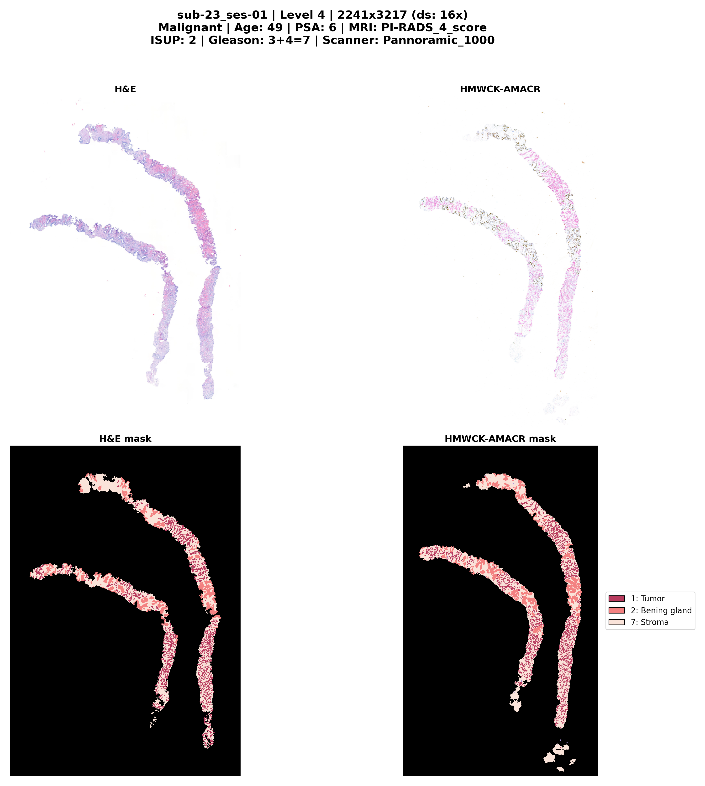
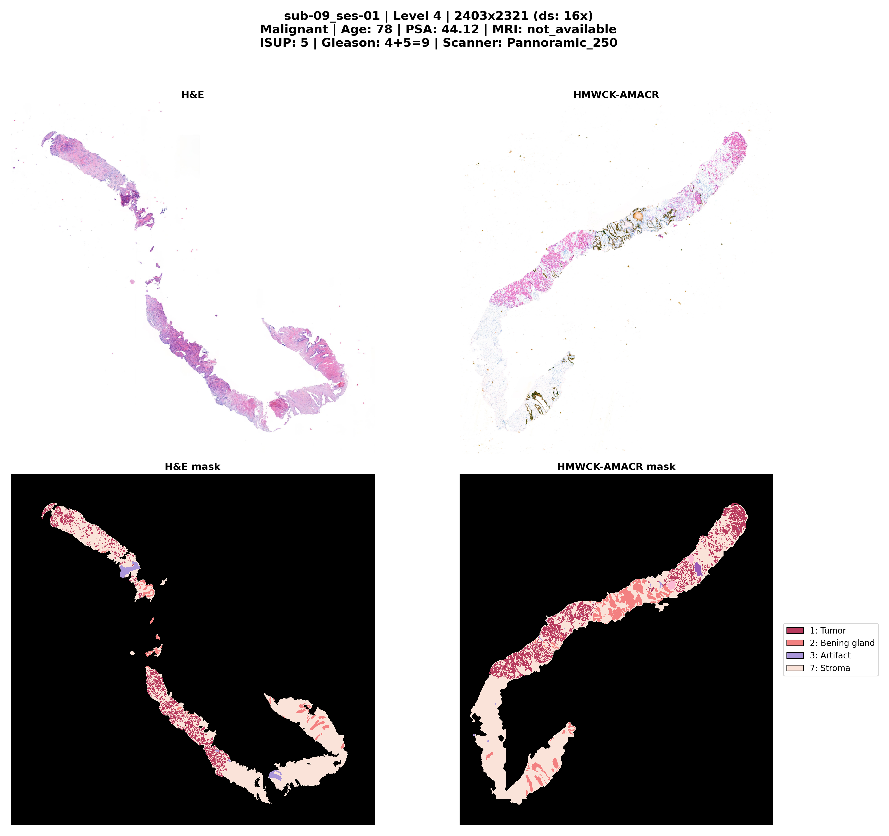
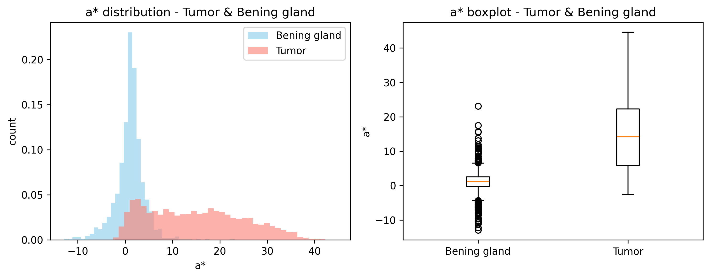
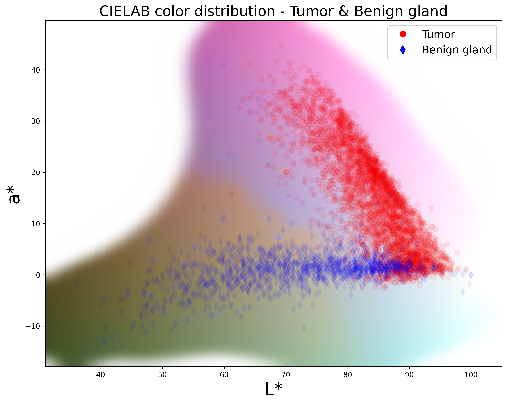

# PRECISE-data-utils

[](https://doi.org/10.5281/zenodo.20721779)
[](https://doi.org/10.5281/zenodo.XXXXXXX)
[](LICENSE.txt)


Utilities for the **PRECISE** prostate H&E–IHC dataset: tools to visualise, process and analyse paired whole-slide images and semantic segmentation masks.

| [](assets/preview/sub-23_ses-01.png) | [](assets/preview/sub-09_ses-01.png) |
|---|---|


---

## Scripts

| Script | Description |
|---|---|
| `qupath_handler_hne_inmuno.py` | Interactive viewer for paired H&E / HMWCK-AMACR images with clinical metadata overlay. Supports pyramid level switching, synchronised pan/zoom, and PNG export. |
| `add_stroma.py` | Detects unlabelled tissue regions and assigns them the *Stroma* class (7) in segmentation masks. Processes large images tile-by-tile with configurable threshold, blur, dilation and erosion. |
| `analyse_regions.py` | Per-instance analysis of connected components per class: area, mean CIELAB colour, 3×3 covariance matrix, and pixel count within a LAB distance threshold. Exports results to CSV. |
| `export_cropped_inmuno.groovy` | QuPath 0.6+ script that crops images and builds the masks, reducing file size significantly while preserving a coherent pyramid. |

### Requirements

Python ≥ **3.10** with the dependencies in [`requirements.txt`](requirements.txt):

```
numpy>=2.4.6
matplotlib>=3.10.9
tifffile>=2026.3.3
Pillow>=12.2.0
scipy>=1.17.1
zarr>=3.1.6
```

Recommended environment setup:

```bash
conda create -n wsi python=3.12
conda activate wsi
pip install -r requirements.txt
```

### Usage

```bash
# Interactive visualisation
conda run -n wsi python qupath_handler_hne_inmuno.py /path/to/prostate_HnE-IHC_dataset

# Batch-save all previews
conda run -n wsi python qupath_handler_hne_inmuno.py /path/to/dataset --batch-save

# Add stroma to masks
python add_stroma.py /path/to/dataset --threshold 240 --dilate 10 --erode 5

# Preview stroma parameters
python add_stroma.py /path/to/dataset --threshold 240 --preview

# Region analysis on HMWCK-AMACR at pyramid level 3
conda run -n wsi python analyse_regions.py /path/to/dataset --stain hmwck-amacr --level 3
```

The Groovy script runs inside **QuPath 0.6+** — open a project, edit `OUTPUT_DIR` at the top of the script, and execute with Ctrl+R.

---

## Analysis & Visualisation

The `assets/` directory includes figures generated from the region analysis pipeline, showing colour-space separability of tissue classes in CIELAB.

| [](assets/correlacion_A_mean_vs_label_boxplot.png) | [](assets/scatter3d_tumor_vs_benigno_con_fondo.png) |
|---|---|
| *Boxplot: mean a* (CIELAB) per class — tumour and benign gland show distinct chromatic distributions.* | *3D scatter plot of tumour vs benign pixels in CIELAB space — classes are partially separable by colour.* |

These plots help validate that semantic classes exhibit measurable photometric differences, which can be exploited for automatic tissue classification.

---

## Dataset

**PRÉCISE** (*Prostate Cancer Evaluation through Immunohistochemistry and Semantic Evaluation*) is a collection of paired H&E and HMWCK-AMACR immunohistochemistry whole-slide images from prostate tissue, with pixel-level semantic segmentation masks.

### Structure (BIDS-like)

```
prostate_HnE-IHC_dataset/
├── participants.csv           # Clinical metadata
├── label_descriptions.json    # Class definitions
├── assets/
└── data/
    ├── sub-01/
    │   ├── ses-01/
    │   │   ├── wsi_h-e/
    │   │   │   ├── sub-01_ses-01_h-e.ome.tif
    │   │   │   └── sub-01_ses-01_h-e_mask.ome.tif
    │   │   └── wsi_hmwck-amacr/
    │   │       ├── sub-01_ses-01_hmwck-amacr.ome.tif
    │   │       └── sub-01_ses-01_hmwck-amacr_mask.ome.tif
    │   ├── ses-02/
    │   └── ses-03/
    ├── sub-02/
    │   └── ses-01/
    └── sub-25/
        └── ses-01/
```

- **25 subjects** (sub-01 to sub-25); sub-01 has 3 sessions, the rest have 1 session.
- **54 paired images** (H&E + HMWCK-AMACR) = 54 whole-slide images, each with its mask = 108 OME-TIFF files.
- **Total size**: ~56 GB.
- Naming: `sub-{XX}_ses-{YY}_{stain}.ome.tif` and `sub-{XX}_ses-{YY}_{stain}_mask.ome.tif`.

### Image Metadata

| Property | Value |
|---|---|
| Format | OME-TIFF, pyramidal |
| Pyramid levels | 6 (downsampling 1×, 2×, 4×, 8×, 16×, 32×) |
| Tile size | 512 × 512 px |
| Compression | LZW (lossless) |
| Physical resolution | 0.243 µm/pixel |
| Colour | RGB (uint8) |
| Scanners | Pannoramic 250 (sub-01–18), Pannoramic 1000 (sub-19–25) |

All scans were performed with 3DHISTECH Pannoramic scanners.

### Clinical Metadata (`participants.csv`)

| Field | Description |
|---|---|
| `IMAGE_NAME` | Image identifier (e.g. sub-01_ses-01) |
| `SUBJECT_ID` | Anonymised subject identifier |
| `SESSION_ID` | Session number (1–3) |
| `AGE` | Age at biopsy |
| `PROSTATE-SPECIFIC_ANTIGEN_(PSA)_LEVEL` | PSA level (ng/mL) |
| `DIGITAL_RECTAL_EXAM` | Unsuspicious / Suspicious |
| `FINDINGS_IN_PELVIC_MRI` | PI-RADS score or not_available |
| `SLIDE_DIAGNOSIS` | Benign / Malignant |
| `ISUP_Grade_Group_` | ISUP grade group (0–5) |
| `Gleason_score` | Gleason score |
| `Scanner` | Pannoramic_250 or Pannoramic_1000 |

### Segmentation Classes (`label_descriptions.json`)

| ID | Class | Colour |
|---|---|---|
| 0 | Background | `#000000` |
| 1 | Tumor | `#B83B5E` |
| 2 | Benign gland | `#F38181` |
| 3 | Artifact | `#AA96DA` |
| 4 | High-grade prostatic intraepithelial neoplasia (HGPIN) | `#FCBAD3` |
| 5 | Intraductal carcinoma | `#FF6B6B` |
| 6 | Atypical intraductal proliferation | `#9B59B6` |
| 7 | Stroma | `#FAE3D9` |

---

## Authors

- **Adriana K. Calapaquí Terán** — *Department of Pathology, University Hospital “Marqués de Valdecilla” & Servicio Cántabro de Salud, Santander, Spain & Instituto de Investigaci´on Sanitaria Valdecilla (IDIVAL)*
- **Abel A. Gonz´alez Bernad** -- *Siali Technologies S.L & Instituto de Investigaci´on Sanitaria Valdecilla (IDIVAL)*

## License

This project is licensed under the **Apache License 2.0** — see [LICENSE.txt](LICENSE.txt).

## Citation

If you use this dataset or tools in your research, please cite:

```
[Citation placeholder — will be added upon publication]
```
